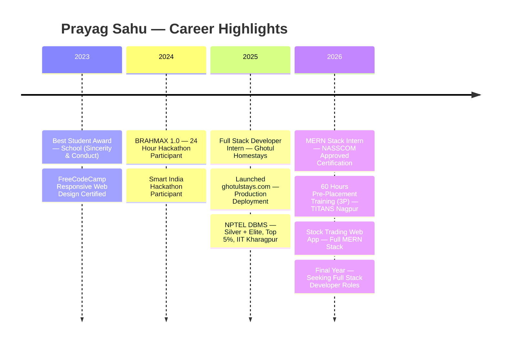

 

&nbsp;

&nbsp;

&nbsp;

---

## About Me

I'm a 3rd-year B.Tech CSE student at **RGPV University, Bhopal** who builds full-stack web applications that run in production — not just on localhost.

My most significant work is **[ghotulstays.com](https://ghotulstays.com)** — a hospitality management platform I architected and deployed solo during my internship at Ghotul Homestays. Real guests book rooms, real payments process through Razorpay, and a real business runs its daily operations on code I wrote. That's the standard I hold my work to.

I hold a **Silver + Elite Top 5% distinction from IIT Kharagpur (NPTEL DBMS)** and a **NASSCOM-approved MERN Stack internship certification**. I'm currently in my placement year, actively seeking full-stack developer roles where I can contribute from day one.

&nbsp;

&nbsp;

&nbsp;

&nbsp;

---

## Career Timeline

---

## Internship Experience

<table width="100%">
<tr>
<td>

### Full Stack Developer Intern — Ghotul Homestays
**12 Months &nbsp;|&nbsp; Sept 2025 – Present &nbsp;|&nbsp; Remote, Guwahati &nbsp;|&nbsp; [ghotulstays.com](https://ghotulstays.com) &nbsp;|&nbsp; [Offer Letter](https://drive.google.com/file/d/1I99XDcE08OFP35MfqVJ_UyG3n0otW-Ug/view?usp=sharing)**

Took a business that ran entirely on manual reservation tracking and replaced it with a production-grade digital system — architected, built, and deployed solo.

- **Room booking system** with real-time availability management and conflict prevention via DB-level locking
- **Staff management portal** with role-based access control — owner, manager, and staff see different interfaces
- **Owner analytics dashboard** for reservation trends, revenue tracking, and occupancy insights
- **Razorpay payment gateway** — full flow: order creation → checkout → webhook verification → booking confirmation
- **JWT authentication** with refresh token rotation and bcrypt-hashed passwords
- **Production deployment** on Hostinger VPS — Nginx reverse proxy, PM2 process management, UptimeRobot monitoring

**Impact:** Eliminated 100% of manual operations. Real guests book and pay online. The business now runs on this system every day.

</td>
</tr>
<tr>
<td>

### MERN Stack Developer Intern — NASSCOM Approved
**2026 &nbsp;|&nbsp; Structured Certification Program**

Completed a structured MERN Stack internship program certified by NASSCOM — covering end-to-end full-stack development practices, modern React patterns, RESTful API design, and MongoDB-based data modeling.

</td>
</tr>
</table>

---

## Tech Stack

**Languages & Core Web Technologies**

**Frontend**

**Backend**

**Databases**

**Tools & Platforms**

**Currently Learning**

---

## Featured Projects

<table>
<tr>
<td width="50%" valign="top">

### Ghotul — Hospitality Management Platform

A full-stack booking and operations system built for a real hospitality business — not a demo. Handles room reservations, staff workflows, Razorpay payments, and business analytics. Live on a production VPS serving actual guests.

**What makes it different:** Every architecture decision had a real-world consequence. Double-booking prevention uses PostgreSQL row-level locking. Payment confirmation uses Razorpay webhook + HMAC verification — not frontend trust. Role-based access means staff can't access owner analytics.

  

&nbsp;

</td>
<td width="50%" valign="top">

### DSA — Data Structures & Algorithms (C++)

A structured, topic-wise problem-solving journal in C++ — built from scratch, follow striver's sheet and neetcode problems. The goal isn't just to solve problems, it's to build the kind of algorithmic thinking that holds up in technical interviews and production-level logic.

**Topics covered:** Arrays · Linked Lists · Stacks & Queues · Trees & Graphs · Sorting & Searching · Recursion & Backtracking · Dynamic Programming (in progress)

  

  

</td>
</tr>

</table>

---

## A Note on How I Work

I don't build things to put on a resume. I build things because there's a problem that needs solving. The Ghotul platform exists because a business needed a real system — and I built one. The DSA journal exists because interview-ready algorithmic thinking doesn't come from watching videos.

If something needs to be built, I figure it out and ship it.

That mindset pushed me to build and deploy multiple real-world projects beyond just coding tutorials or clone apps. In several cases, I collaborated with AI-assisted workflows for UI ideas and architecture exploration, while personally handling the actual integration, debugging, deployment, testing, and production fixes. That process strengthened my skills as both a developer and a problem solver.

Some of those projects include:

- **The Light Room** — A photographer portfolio platform built for my brother to showcase his work professionally.
  
   &nbsp;|&nbsp; 

- **Sachin Men's Parlor** — A barber appointment booking web application designed for a local men's salon to manage customer bookings efficiently.
  
   &nbsp;|&nbsp; 

- **Shopsy** — An online clothing store for boys and girls with product browsing and shopping functionality.
  
   &nbsp;|&nbsp; 

I care more about building useful systems that actually work in the real world than building projects just to fill a portfolio.

---

## GitHub Stats

&nbsp;

 

---

## Achievements & Certifications

| Year | Category | Detail |
|------|----------|--------|
| 2026 | **Internship** | MERN Stack Internship — NASSCOM-Approved Certification |
| 2026 | **Training** | 60 Hours Pre-Placement Training (3P) — TITANS Nagpur |
| 2025 | **Internship** | Full Stack Development Internship Certificate — Ghotul Homestays |
| 2025 | **Academic** | Silver + Elite, Top 5% — NPTEL DBMS, IIT Kharagpur |
| 2024 | **Hackathon** | BRAHMAX 1.0 — 24 Hour Hackathon Participant |
| 2024 | **Hackathon** | Smart India Hackathon Participant |
| 2023 | **Certification** | FreeCodeCamp Responsive Web Design |
| 2023 | **Award** | Best Student — School Award for Sincerity & Conduct |

---

## Education

**B.Tech — Computer Science & Engineering**
RGPV University, Madhya Pradesh &nbsp;|&nbsp; 2023 – 2027 &nbsp;|&nbsp; CGPA: 8.35 / 10

---

## Let's Connect

&nbsp;

&nbsp;

 

> **Open to:** Full Stack Developer roles &nbsp;·&nbsp; MERN Internships &nbsp;·&nbsp; Hackathon teams &nbsp;·&nbsp; Freelance projects
>
> **Strong in:** React, Node.js, PostgreSQL, REST API design, Payment integration, VPS deployment
>
> **Working toward:** System design, application scaling, DevOps fundamentals

---

 

**[sahuprayag229@gmail.com](mailto:sahuprayag229@gmail.com) &nbsp;·&nbsp; [prayagsahu.vercel.app](https://prayagsahu.vercel.app) &nbsp;·&nbsp; [LinkedIn](https://www.linkedin.com/in/prayag-sahu29/) &nbsp;·&nbsp; [ghotulstays.com](https://ghotulstays.com)**

